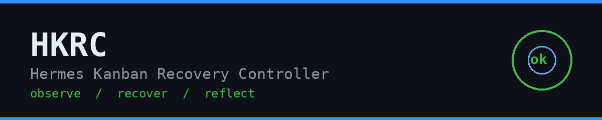
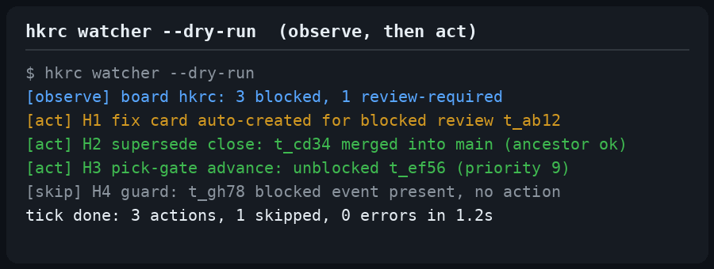
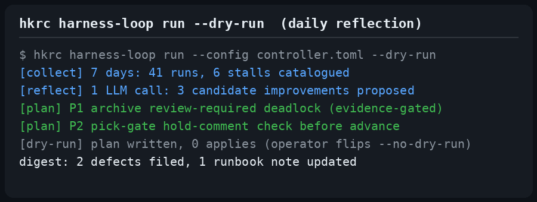

# Hermes Kanban Recovery Controller (HKRC)

[](https://github.com/andrepontesmelo/hkrc/actions/workflows/ci.yml)




A sidecar daemon that complements the [Hermes](https://hermes-agent.nousresearch.com/docs)
Kanban workflow: it observes task execution, keeps instances healthy, and reflects daily
on how the orchestration layer itself can improve.

## Why it exists

Hermes Kanban is a great fit for task decomposition and orchestration — and not perfect.
Corner cases exist where a task gets stuck, or the orchestration workflow itself needs
improvement. HKRC exists so the problems and inefficiencies observed on a board are
**catalogued and never repeated**, instead of being rediscovered by hand.

The endgame is deliberate: ideally Hermes Kanban shouldn't need a sidecar at all. Fixes
and improvements should land in Hermes source so the sidecar becomes unnecessary — but
even then, looking back and reflecting always adds value.

## What it does

HKRC is a deterministic state machine — never an autonomous LLM agent. It has two halves:

**Everyday operation — deterministic watchdogs.** A daemon plus cron-driven watchdogs
observe Kanban execution and automatically act on catalogued corner cases, today:

- **Review blocks with a defect payload → fix card auto-created** (one per review, per
  block episode; deduplicated).
- **Fix verified merged → the supersede loop closes**: the defect-blocked review completes
  with verified evidence (`git merge-base --is-ancestor` — version claims lie, merge state
  doesn't), and gated children are promoted.
- **Pick-gate auto-advance**: after a task completes, the highest-priority parked
  `needs_input` card is unblocked — never when any capability-blocked card exists, the
  card or its parents are on hold, or a recent comment says `hold`.
- **Promotable-blocked guard**: a task created as `blocked` without a block event would be
  silently auto-promoted by the dispatcher; the watcher writes the missing event.
- **Review-required deadlock archive**: a blocked parent whose reason already carries
  completion evidence strands its review child forever; the watcher archives the parent —
  only with evidence, only with a review child, never otherwise (fail-closed).

Alongside the watcher, deterministic watchdogs ping you when a task waits on your input
(`needs-input-watcher`), when a dispatcher death leaves a silent block
(`stale-block-watch`), when a done card is missing its review pair (`review-gap`), and
when decisions stall (`watcher`). Git admission enforcement for protected refs ships as
the **Outcome Guard** — operator-registered contracts plus a Git hook that denies
unprotected canonical-ref updates.

**Daily reflection — one LLM call.** Every day (you choose when), HKRC deterministically
collects metrics on the previous day's executions and makes a single LLM request proposing
improvements to the orchestration workflow. The goal is not to fix tasks directly — it's
to expand the catalogued corner-case layer so what went wrong doesn't repeat.

**Configuration is two lines**: the model for the LLM reflection, and the time of day it
runs. That's it.

## When to reach for it

- You run Hermes with a Kanban board and stuck tasks accumulate faster than you can
  unblock them by hand.
- You want the observed failures and inefficiencies of your orchestration layer to be
  catalogued and prevented, not rediscovered.
- You want a daily self-review loop that audits the orchestration layer and routes
  accepted findings onto the HKRC board.
- You want Git admission enforcement for protected refs.

Do **not** reach for it to open or edit native Hermes source, config, or task databases —
that safety boundary is absolute.

## Install

Requires Python 3.11+ and [uv](https://docs.astral.sh/uv/). Zero runtime third-party
dependencies.

```bash
git clone https://github.com/andrepontesmelo/hkrc
cd hkrc
uv sync --dev
uv run pytest                       # full suite green
```

Verify the gate is green before using the checkout. A `github:` install
resolves the default branch at install time — pin a tag for reproducibility.

> [!WARNING]
> The daemon observes Kanban boards and takes automated recovery actions on
> catalogued corner cases: fix-card creation, review completion on verified
> merge, pick-gate advance, missing-event guard, evidence-backed deadlock
> archive. Audit the controller config before deploying a config you did not
> write. The config surface is the model for the daily LLM reflection plus the
> daily-reflection time — scope exactly that, and start every watchdog with
> `--dry-run`.

Useful commands once installed:

```bash
uv run pytest        # full suite — currently 1062 tests
hkrc --help          # every command (init/status/discover/run/daemon/…/flag)
```

```bash
python3 scripts/hkrc_release.py install --instance-root <instance-root>
hkrc init                           # writes controller config + state DB
```

The release never installs, enables, or starts a service — that stays an operator action.
The full fresh-machine walkthrough (systemd opt-in, cron reconciliation, upgrade/rollback)
is in the README's [**Install on a fresh machine**](README.md#install-on-a-fresh-machine)
section.

## Requirements

- Python 3.11+, uv; a running Hermes instance with Kanban boards.
- Cron for the watchdog cadence; systemd optional, always opt-in.

## Decision-latency watcher (`watcher`)

The `watcher` command closes the four decision-latency stalls measured in daily
operation: defect-blocked reviews waiting on a fix card, supersede bookkeeping,
the one-at-a-time pick gate, and blocked-on-creation tasks. It auto-creates fix
cards from reviewer defect blocks (idempotent per review + block episode) and,
when a fix is verified merged into the canonical branch (`git merge-base
--is-ancestor`, never a claimed SHA), completes the original review and
promotes any gated children.



> PLACEHOLDER observe-then-act — mock drafted from documented example values; swap for a real capture at review.

## Session friction flags (`friction-flag` skill)

When a session hits friction — blocked twice on the same thing, a repeated re-ask, a
missed skill trigger, a silent failure, an ADHD-contract miss — the agent appends one
flag itself with a fail-closed one-liner (inert if the `hkrc` binary is absent):

```bash
HKRC="$HOME/.hermes/hkrc/bin/hkrc"; [ -x "$HKRC" ] && "$HKRC" flag --severity <low|medium|high> --kind <orchestration|tooling|working-agreement|other> --note "<one line>" || true
```

There is **no detection mechanism**: the agent adds flags; nothing scans sessions or
raises findings. The daily harness-learning-loop revisits new flags as report lines and
stats only — identical repeats collapse to xN. The skill ships with every release to
`<instance-root>/skills/friction-flag/`.

## Harness learning loop (`harness-loop`)

A nightly 7-day self-review of the instance's own sessions, distilled into
classified defects and a graded improvement digest. `hkrc harness-loop run
--config <config.toml>` (ports the legacy `f69651252ba1` cron job). Start with
`--dry-run`: the loop writes its plan and escalations without dispatching until
you flip it on. The verbatim prompt lives in
[references/harness-loop-prompt.md](references/harness-loop-prompt.md).



> PLACEHOLDER daily-reflection — mock drafted from documented example values; swap for a real capture at review.

## Deep dives

- [Docs index](docs/index.md) — start here: architecture, development, outcome
  guard, persona-matrix runbook.

- [Decision-latency watcher (`watcher`)](references/orchestrator-escalation-rule.md) — why stalled
  decisions get escalated, and how the watchdog cadence is computed.
- [Harness learning loop (`harness-loop`)](references/harness-loop-prompt.md) — the nightly
  self-review loop prompt and escalation rule.
- [Persona matrix (`persona_matrix`)](references/persona-matrix.md) and its operational
  [runbook](docs/persona-matrix-runbook.md) — role/persona drift detection and evidence.

## Contributing

PRs welcome — see [CONTRIBUTING.md](CONTRIBUTING.md) for the workflow and the local gate.
Security issues: [SECURITY.md](SECURITY.md) (do not open a public issue).

## Test

```bash
uv run pytest        # full suite — currently 1062 tests
```

## License

MIT — see [LICENSE](LICENSE).
